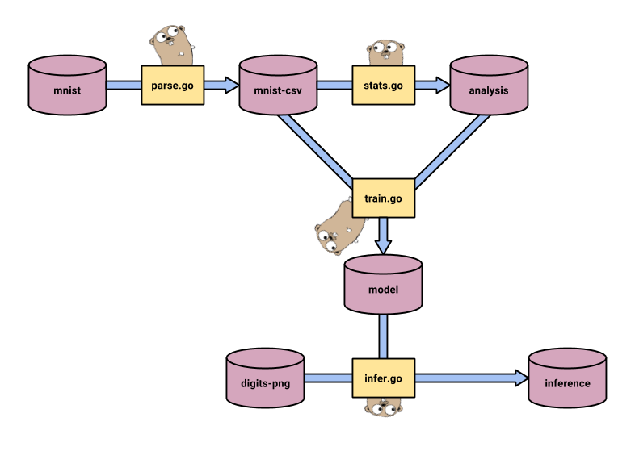

# Pachyderm ML example with Go

## What is this?

## Overview of the code

```
.
├── cmd   [stand-alone programs]
│   ├── image   [reads an inference and outputs a GIF image]
│   ├── infer   [reads a model and attributes and outputs a prediction]
│   ├── parse   [reads MNIST binary format and outputs a CSVs encoding]
│   ├── stats   [reads a model and computes statistical information about it]
│   └── train   [reads training data and outputs representations of a trained model]
└── doc   [documentation about this repository libraries]
```

## Overview of the data

## The Pachyderm pipeline


